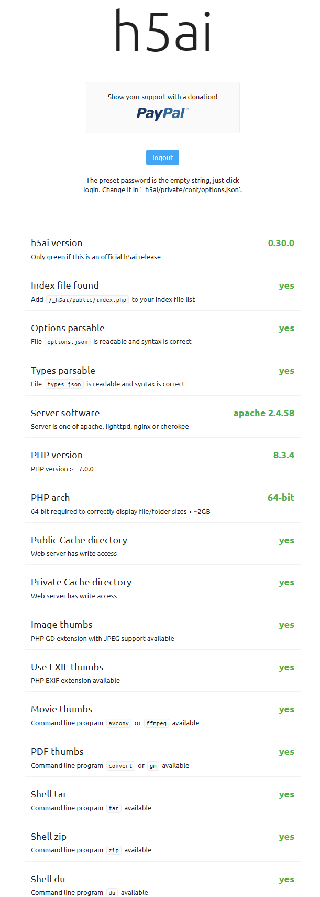

##### `h5ai自用修改版`
- 谷歌字体离线使用，避免加载缓慢
- 设置默认语言为简体中文
- 只保留简体中文/繁体中文/英文语言文件，其余删除
- 增加DPlayer，支持倍速播放视频
#### 🚩 modern HTTP web server index
- h5ai 是用于 HTTP Web 服务器的现代文件索引器，专注于您的文件。目录以一种吸引人的方式显示，浏览它们可以通过不同的视图、面包屑和树概述来增强。最初，h5ai 是 HTML5 Apache Index 的首字母缩写，但现在它也支持其他 Web 服务器
- 需要 PHP 7.0+，并且可以与 Apache httpd、lighttpd 和 nginx 配合使用。使用最新版本的基于 Chromium 的浏览器（Firefox、Safari 和 Edge）提供最佳用户体验，但为较旧的浏览器或禁用 JavaScript 提供了静态回退



##### 🚩 拉取镜像:
```sh
$ docker run -it --name h5ai --rm -p 8080:80 -v pwd:/www jellyfina/h5ai
```
##### 🚩 进入容器:
```sh
$ docker exec -it h5ai sh
```
##### 🚩 部署h5ai:
```sh
sh -c "$(curl -kfsSl https://raw.githubusercontent.com/jellyfina/h5ai/main/h5ai.sh)"
```
